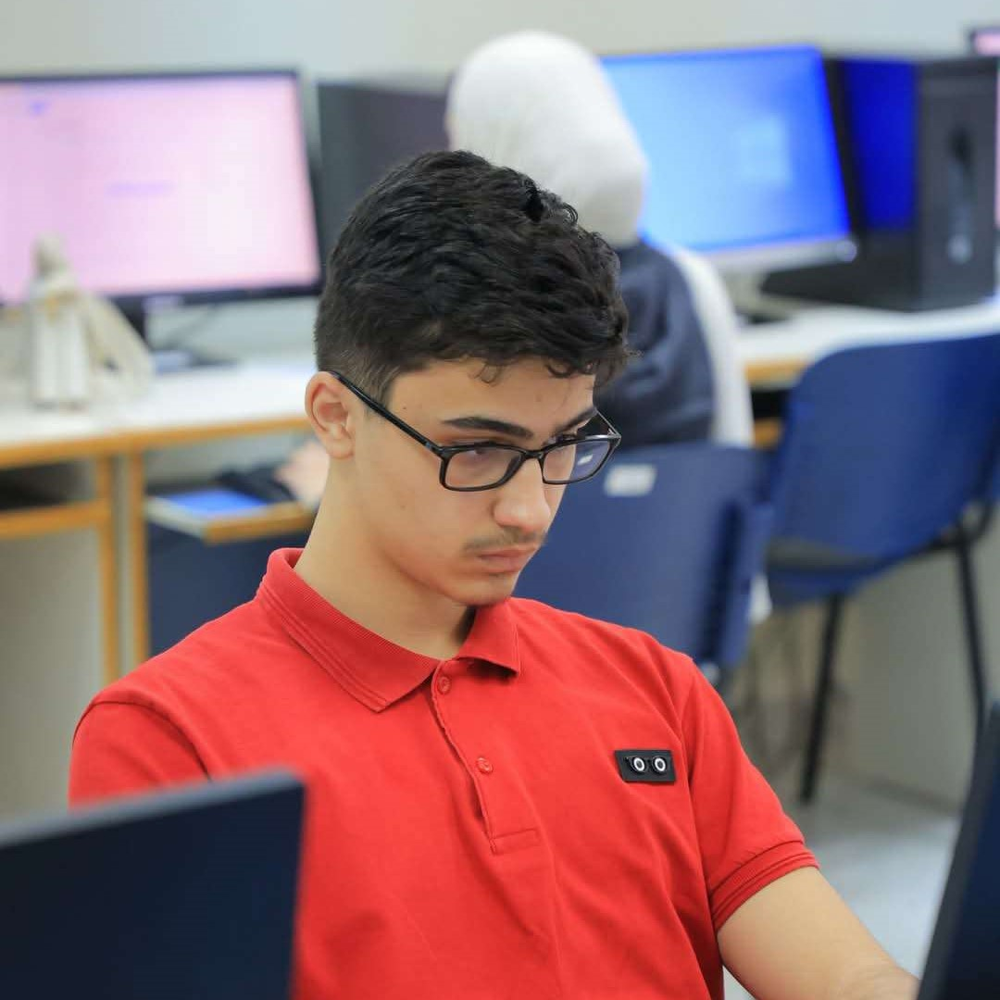

## WRO-FUTURE-ENGINEERS-2025 - TEAM TUREAH

<p align="center">

</p>


---

## Vehicle Preview
<p align="center">

</p>

---
An autonomous vehicle designed for the Future Engineers category of the WRO 2025 that uses computer vision and IMU sensors to navigate complex environments and avoid obstacles intelligently.

## Content Structure

📁 **t-photos** → [team photos ](https://github.com/MohdAttili/TSISFE2025/tree/main/t-photos)   
📁 **v-photos** → [vehicle photos  ](https://github.com/MohdAttili/TSISFE2025/tree/main/v-photos)   
📁 **video** → [video.md with demonstration link  ](https://github.com/MohdAttili/TSISFE2025/tree/main/video)   
📁 **schemes** → [schematic diagrams ](https://github.com/MohdAttili/TSISFE2025/tree/main/schemes)    
📁 **src** → [control software  ](https://github.com/MohdAttili/TSISFE2025/tree/main/src)   
📁 **models** → [3D printing / laser cutting / CNC files ](https://github.com/MohdAttili/TSISFE2025/tree/main/models)    
📁 **other** → [documentation and additional resources  ](https://github.com/MohdAttili/TSISFE2025/tree/main/other)   
## Project Overview
This repository contains all the engineering materials, code, schematics, and models related to our self-driven vehicle, designed and built to participate in the WRO Future Engineers 2025 competition. The project aims to develop an autonomous vehicle capable of navigating a predefined course while demonstrating precision, stability, and effective control of electromechanical components.

Our vehicle is a compact, versatile model incorporating both mechanical and electronic systems. It is designed to efficiently demonstrate autonomous navigation using sensors, motor control, and a central microcontroller. The design and implementation of this project involved detailed planning, testing, and iterative improvements to meet the strict requirements of the competition.
## -------------------------------------------------------------------------------------
## Who We Are

<!-- <p align="center">



</p> -->

<table border="1">
  <tr>
    <td align="center">
      <br>
      Osama Jadbah
    </td>
    <td align="center">
      <br>
      Mohammad Attili
    </td>
    <td align="center">
      <br>
      Kareem Amr
    </td>    
  </tr>
</table>

We are a team of three passionate Palestinian students from Tulkarm Industrial Secondary School, united by our love for programming, artificial intelligence, and problem-solving. Osama Jadbah, an 11th-grade student, focuses on lifelong learning, self-development, and has earned multiple excellence certificates for his achievements. Mohammad Attili, 16, is a competitive programmer who has excelled in national and international contests, showcasing his innovation and tech skills. Kareem Amr, also 16, is a skilled programmer and problem solver, experienced in algorithms and competitive programming, and an accomplished chess player who earned 3rd place in the Palestinian Chess Championship. Together, we strive to develop our skills, tackle challenging projects, and explore new technological horizons.
[Further Information](https://github.com/MohdAttili/TSISFE2025/blob/main/t-photos/Team%20Description.pdf)

## -------------------------------------------------------------------------------------
## 🔍 Project Description
**🎯 Goals**  
1. Build a functional self-driven vehicle that can navigate a course autonomously.  
2. Integrate electronic and mechanical components seamlessly.  
3. Develop modular and maintainable code to control all vehicle components.  
4. Document all aspects of the vehicle's design, construction, and programming.  
5. Provide clear and detailed engineering materials to facilitate understanding and replication.  

 ## ⚙️ Physical Equipment  
**1. 🧠 ESP32-WROOM-32 Overview**
1. ESP32-WROOM-32 is a microcontroller by Espressif with Wi-Fi and Bluetooth, commonly used in smart devices and robotics.
2. It features a dual-core Xtensa 32-bit LX6 processor up to 240 MHz, with 520 KB SRAM and 4 MB Flash.
3. Offers around 34 programmable GPIO pins and interfaces like SPI, I2C,  UART, PWM, and I2S, with ADC/DAC support.  
4. Supports dual connectivity, multiple protocols, and has a large  community with ready-to-use libraries.  
5. Common applications include robotics, smart home systems, remote   measurement/control devices, and IoT data collection.  
                    
**2. 🤖 L298N (Motor Driver Module) Overview**
1. The L298N is a dual H-bridge motor driver used to control the speed and direction of DC and stepper motors.
2. Supports motor voltages from 5V to 35V and currents up to 2A per channel.
3. Motor direction is controlled via IN1–IN4 pins and speed via PWM (ENA/ENB pins).
4. Features include independent dual motor control, built-in heat sink, and easy interfacing with Arduino, ESP32, and Raspberry Pi.
5. Commonly used in robotics, motorized DIY projects, and stepper motor control for small CNC machines or 3D printers.

**3. 📏 HC-SR04 Ultrasonic Sensor Overview**     
1. Ultrasonic distance sensor used to measure distances to objects.
2. Sends ultrasonic waves and calculates the time for echo return.
3. Affordable, simple, and widely used in robotics and obstacle detection.
4. Features a simple 4-pin interface: VCC, GND, TRIG, ECHO.
5. Provides accurate distance measurement (2 cm – 400 cm, ±3 mm).
     
**4.🎥 Pixy 2.1 (CMUcam5) Overview**
1. The Pixy 2.1 is a smart vision sensor that detects and tracks objects by color or shape.
2. Resolution: 320×200 pixels, frame rate up to 60 fps, with interfaces SPI, I²C, UART, and USB.
3. Built-in processor allows real-time object recognition and can track multiple objects simultaneously.
4. Sends object coordinates directly to microcontrollers like Arduino or ESP32, reducing main board load.
5. Common applications include line-following robots, object detection/sorting, interactive projects, and educational AI experiments.

**5. 🚗 LEGO Wheel Ø56 with Medium Azure Tire Overview**
1. LEGO Technic wheel with a 56 mm diameter and medium azure rubber tire.
2. Part numbers: 39367 (wheel) and 1282073 (tire).
3. Designed for medium-sized LEGO vehicles and robots.
4. Durable and easy to fit with LEGO axles, providing reliable traction.
5. Common uses: LEGO Mindstorms robots, Spike Prime projects, and DIY educational builds.

**6. ⚡ GM25 370 Motor Overview**
1. The GM25 370 is a compact DC geared motor with ~260 RPM at 6V DC.
2. Provides high torque output, ideal for driving wheels and robotic arms.
3. Shaft diameter ~4 mm with standard mounting holes for small chassis.
4. Can include a hall encoder for precise speed/position feedback.
5. Commonly used in small robots, cars, and DIY mechanical systems.      
                 
**7. ⚙️ EV3 Medium Motor Overview**

1. A LEGO Mindstorms motor designed for precise and controlled movement.
2. Operates at ~255 RPM with medium torque, ideal for steering mechanisms.
3. Features a built-in rotation sensor for accurate position feedback.
4. Supports precise angle control (servo-like behavior) and smooth acceleration.
5. Commonly used in LEGO Technic robots for steering and articulated parts.
      
**8. 🧩 EV3 LEGO Technic Set Pieces Overview**
1. Modular LEGO Technic parts used to build robots, vehicles, and mechanical systems.
2. Include beams, liftarms, axles, connectors, gears, pulleys, pins, and bushings.
3. Provide the structural framework and enable integration of motors, sensors, and controllers.
4. Designed for reusability and compatibility with LEGO EV3 robotics kits.
5. Commonly used for creating chassis, motion systems, and custom robotic designs.    

[More Details about the Components](https://github.com/MohdAttili/TSISFE2025/blob/main/other/Selected%20Components.pdf)

[Comparisons with Other Components in the Market](https://github.com/MohdAttili/TSISFE2025/blob/main/other/Comparison%20with%20Other%20Components.pdf) 
 <p align="center">
  
  
  
  
  
  
  
  
</p>

## -------------------------------------------------------------------------------------
## 🎮 The Code 
**Cam Test Code**
```cpp
#include <Pixy2I2C.h>
#include <Wire.h>

Pixy2I2C cam;

void setup() {
Serial.begin(115200);
Wire.begin(21, 22); 
cam.init();
delay(500);
}
```
<details>
<summary>Show remaining code</summary>

```cpp
    char getObstcaleColor(){
    cam.ccc.getBlocks();
    int numBlocks = cam.ccc.numBlocks;
    if (numBlocks > 0) {
        int largestIndex = 0;
        int maxArea = 0;

        
        for (int i = 0; i < numBlocks; i++) {
        int area = cam.ccc.blocks[i].m_width * cam.ccc.blocks[i].m_height;
        if (area > maxArea) {
            maxArea = area;
            largestIndex = i;
        }
        }
        
        int obstcaleColor =cam.ccc.blocks[largestIndex].m_signature;
        
        if(obstcaleColor == 1||obstcaleColor == 2||obstcaleColor == 3||obstcaleColor == 4){
        return 'R';
        }
        else if (obstcaleColor == 5||obstcaleColor == 6||obstcaleColor == 7||obstcaleColor == 8){
        return 'G';
        }
        else{
        return 'U';
        }
    }
    else{
        return 'N';
        }
    }
    void loop() {

    Serial.println(getObstcaleColor());
    delay(200);

    }
```
</details>

## --------------------------------------------------------------------------------------
**Ultrasonic Sensor Code**

```cpp

    // Ultrasonic Sensor Pins
    const int TRIG1 = 27;
    const int ECHO1 = 14;

    const int TRIG2 = 12;
    const int ECHO2 = 13;

    const int TRIG3 = 2;
    const int ECHO3 = 15;

    // Sensor names
    String sensorNames[] = {"Sensor 1", "Sensor 2", "Sensor 3"};

    void setup() {
    Serial.begin(115200);
 ```   
<details>
<summary>Show remaining code</summary>

```cpp
    // Ultrasonic Sensor Pins
    const int TRIG1 = 27;
    const int ECHO1 = 14;

    const int TRIG2 = 12;
    const int ECHO2 = 13;

    const int TRIG3 = 2;
    const int ECHO3 = 15;

    // Sensor names
    String sensorNames[] = {"Sensor 1", "Sensor 2", "Sensor 3"};

    void setup() {
    Serial.begin(115200);


    // Initialize trigger pins as outputs
    pinMode(TRIG1, OUTPUT);
    pinMode(TRIG2, OUTPUT);
    pinMode(TRIG3, OUTPUT);
    
    // Initialize echo pins as inputs
    pinMode(ECHO1, INPUT);
    pinMode(ECHO2, INPUT);
    pinMode(ECHO3, INPUT);
    
    // Ensure triggers are low
    digitalWrite(TRIG1, LOW);
    digitalWrite(TRIG2, LOW);
    digitalWrite(TRIG3, LOW);
    
    Serial.println("ESP32 Ultrasonic Sensor Test");
    Serial.println("=============================");
    delay(100);
    }

    long getDistance(int trigPin, int echoPin) {
    digitalWrite(trigPin, LOW);
    delayMicroseconds(2);
    
    // Send 10 microsecond pulse
    digitalWrite(trigPin, HIGH);
    delayMicroseconds(10);
    digitalWrite(trigPin, LOW);
    
    // Read the echo pulse duration
    long duration = pulseIn(echoPin, HIGH, 30000); // 30ms timeout (~5m range)
    
    // Calculate distance in cm
    long distance = duration * 0.034 / 2;
    
    return distance;
    }

    void testAllSensors() {
    Serial.println("\nTesting all sensors...");
    Serial.println("---------------------");
    
    // Test Sensor 1
    long dist1 = getDistance(TRIG1, ECHO1);
    Serial.print(sensorNames[0] + ": ");
    if (dist1 > 0 && dist1 < 400) {
        Serial.print(dist1);
        Serial.println(" cm");
    } else {
        Serial.println("Out of range");
    }
    
    // Test Sensor 2
    long dist2 = getDistance(TRIG2, ECHO2);
    Serial.print(sensorNames[1] + ": ");
    if (dist2 > 0 && dist2 < 400) {
        Serial.print(dist2);
        Serial.println(" cm");
    } else {
        Serial.println("Out of range");
    }
  
```
</details>

## --------------------------------------------------------------------------------------

**Sensor Testing Code**
```cpp
// Motor Control Pins
#define ENA 16    // PWM pin for speed control
#define IN1 17    // Direction control 1
#define IN2 5     // Direction control 2

// Encoder Pins
#define ENC_A 32  // Encoder channel A
#define ENC_B 33  // Encoder channel B

// Variables for encoder counting
volatile long encoderCount = 0;
int lastEncA = 0;
int lastEncB = 0;

// Motor control parameters
int motorSpeed = 200;  // PWM value (0-255)
bool motorDirection = true; // true = forward, false = reverse

 ```   
<details>
<summary>Show remaining code</summary>

```cpp

void setup() {
  // Initialize serial communication
  Serial.begin(115200);
  
  // Set motor control pins as outputs
  pinMode(ENA, OUTPUT);
  pinMode(IN1, OUTPUT);
  pinMode(IN2, OUTPUT);
  
  // Set encoder pins as inputs with pullup resistors
  pinMode(ENC_A, INPUT_PULLUP);
  pinMode(ENC_B, INPUT_PULLUP);
  
  // Read initial encoder state
  lastEncA = digitalRead(ENC_A);
  lastEncB = digitalRead(ENC_B);
  
  // Attach interrupt for encoder pin A
  attachInterrupt(digitalPinToInterrupt(ENC_A), updateEncoder, CHANGE);
  
  Serial.println("ESP32 Motor Control with Encoder");
  Serial.println("Commands: ");
  Serial.println("  F - Forward");
  Serial.println("  R - Reverse");
  Serial.println("  S - Stop");
  Serial.println("  + - Increase Speed");
  Serial.println("  - - Decrease Speed");
  Serial.println("  P - Print encoder count");
}

void loop() {
  // Check for serial commands
  if (Serial.available()) {
    char command = Serial.read();
    
    switch(command) {
      case 'F':
      case 'f':
        motorForward();
        Serial.println("Motor: FORWARD");
        break;
        
      case 'R':
      case 'r':
        motorReverse();
        Serial.println("Motor: REVERSE");
        break;
        
      case 'S':
      case 's':
        motorStop();
        Serial.println("Motor: STOP");
        break;
        
      case '+':
        increaseSpeed();
        Serial.print("Speed increased to: ");
        Serial.println(motorSpeed);
        break;
        
      case '-':
        decreaseSpeed();
        Serial.print("Speed decreased to: ");
        Serial.println(motorSpeed);
        break;
        
      case 'P':
      case 'p':
        Serial.print("Encoder pulses: ");
        Serial.println(encoderCount);
        break;
    }
  }
  
  // Small delay to prevent overwhelming the serial
  delay(100);
}

// Encoder interrupt service routine
void updateEncoder() {
  int currentEncA = digitalRead(ENC_A);
  int currentEncB = digitalRead(ENC_B);
  
  // Determine direction based on state changes
  if (currentEncA != lastEncA) {
    if (currentEncA == currentEncB) {
      encoderCount++;
    } else {
      encoderCount--;
    }
  } else if (currentEncB != lastEncB) {
    if (currentEncA == currentEncB) {
      encoderCount--;
    } else {
      encoderCount++;
    }
  }
  
  lastEncA = currentEncA;
  lastEncB = currentEncB;
}

// Motor control functions
void motorForward() {
  digitalWrite(IN1, HIGH);
  digitalWrite(IN2, LOW);
  analogWrite(ENA, motorSpeed);
  motorDirection = true;
}

void motorReverse() {
  digitalWrite(IN1, LOW);
  digitalWrite(IN2, HIGH);
  analogWrite(ENA, motorSpeed);
  motorDirection = false;
}

void motorStop() {
  digitalWrite(IN1, LOW);
  digitalWrite(IN2, LOW);
  analogWrite(ENA, 0);
}

void increaseSpeed() {
  motorSpeed = min(255, motorSpeed + 25);
  analogWrite(ENA, motorSpeed);
}

void decreaseSpeed() {
  motorSpeed = max(0, motorSpeed - 25);
  analogWrite(ENA, motorSpeed);
}

```
</details>

## --------------------------------------------------------------------------------------

```cpp

#include <ESP32Servo.h>
#include <Arduino.h>
#include <Wire.h>
#include <NewPing.h>
Servo myservo;
const int MPU_addr = 0x68;
float gyroX_bias = 0;
float gyroY_bias = 0;
float gyroZ_bias = 0;
float yaw = 0;
const int servoPin = 13; 

#define US_LEFT_TRIG 27
#define US_LEFT_ECHO 14
#define US_FRONT_TRIG 12
#define US_FRONT_ECHO 13
#define US_RIGHT_TRIG 2
#define US_RIGHT_ECHO 15

#define MOTOR1_IN1 17
#define MOTOR1_IN2 5
#define MOTOR1_ENA 16

NewPing sonar_left(US_LEFT_TRIG, US_LEFT_ECHO, MAX_DISTANCE);
NewPing sonar_front(US_FRONT_TRIG, US_FRONT_ECHO, MAX_DISTANCE);
NewPing sonar_right(US_RIGHT_TRIG, US_RIGHT_ECHO, MAX_DISTANCE);

float measured_distance_left = 0, measured_distance_front = 0,measured_distance_right=0;
int current_steering_angle = 0;
int target_steering_angle = 0;

const int MOTOR1_CHANNEL = 0;

#define MAX_STEERING_ANGLE 20

int16_t read16(int addr) {
  int16_t value;
  Wire.beginTransmission((uint8_t)MPU_addr);
  Wire.write((uint8_t)addr);
  Wire.endTransmission(false);
  Wire.requestFrom((uint16_t)MPU_addr, (uint8_t)2, (uint8_t)true);
  value = (Wire.read() << 8) | Wire.read();
  return value;
}
 ```   
<details>
<summary>Show remaining code</summary>

```cpp
void calibrateGyro(int samples = 200) {
  long sumX = 0, sumY = 0, sumZ = 0;
  for (int i = 0; i < samples; i++) {
    int16_t gx = read16(0x43);
    int16_t gy = read16(0x45);
    int16_t gz = read16(0x47);
    sumX += gx; sumY += gy; sumZ += gz;
    delay(5);
  }
  gyroX_bias = sumX / (float)samples;
  gyroY_bias = sumY / (float)samples;
  gyroZ_bias = sumZ / (float)samples;
  Serial.println("Calibration done!");
  Serial.print("Bias Z (Yaw): "); Serial.println(gyroZ_bias);
}

void resetGyro() {
  yaw = 0;
  prevTime = millis();
}

void setupMPU() {
  Wire.begin();
  Wire.beginTransmission(MPU_addr);
  Wire.write(0x6B);
  Wire.write(0);
  Wire.endTransmission(true);
}

float getYaw() {
  unsigned long currentTime = millis();
  float dt = (currentTime - prevTime) / 1000.0;
  prevTime = currentTime;

  int16_t gz_raw = read16(0x47);
  float gz = gz_raw - gyroZ_bias;
  float gz_dps = gz / 131.0;

  yaw += gz_dps * dt;
  if (yaw > 180) yaw -= 360;
  if (yaw < -180) yaw += 360;

  return yaw;
}


void set_drive_motor(int speed) {
  speed = constrain(speed, -255, 255);
  if (speed >= 0) {
    digitalWrite(MOTOR1_IN1, HIGH);
    digitalWrite(MOTOR1_IN2, LOW);
  } else {
    digitalWrite(MOTOR1_IN1, LOW);
    digitalWrite(MOTOR1_IN2, HIGH);
  }
  ledcWrite(MOTOR1_CHANNEL, abs(speed));
}
// Define the min and max pulse widths for the DS558HV servo
// These values might need calibration for optimal performance
// Standard values are 500us to 2500us for 180 degrees.
// For a 40 degree servo, we need to find the pulse width for -20, 0, and +20 degrees.
// Let\'s assume a linear mapping for now. If 1500us is 0 degrees, and the total travel is 40 degrees,
// then 20 degrees corresponds to a certain pulse width change.
// A common mapping for 180 degrees is 500us to 2500us (2000us range).
// For 40 degrees, the range would be (40.0/180.0) * 2000.0 = 444.44us. (Using floats for precision)
// So, if 0 degrees is 1500us, then -20 degrees would be 1500 - (444.44/2) = 1500 - 222.22 = 1277.78us.
// And +20 degrees would be 1500 + (444.44/2) = 1500 + 222.22 = 1722.22us.
// Let\'s use these calculated values as a starting point, rounded to integers.


const int center = 1500; // Pulse width for 0 degrees (approx)

void setup() {
  Serial.begin(115200);
  myservo.setPeriodHertz(50); // Standard 50Hz servo
  myservo.attach(servoPin, MIN_PULSE_WIDTH, MAX_PULSE_WIDTH);
  Serial.println("Servo initialized. Moving to 0 degrees.");
  setAngle(0); // Move to initial 0 degree position
}

float get_filtered_distance(NewPing &sensor) {
  float sum = 0;
  byte valid = 0;
  for (byte i = 0; i <5; i++) {
    delay(5);
    float dist = sensor.ping_cm();
    if (dist > 0 && dist < MAX_DISTANCE) {
      sum += dist;
      valid++;
    }
  }
  return valid > 0 ? sum / valid : 0;
}

void setAngle(int angle) {
  long pulseWidth = map(angle, -MAX_STEERING_ANGLE, MAX_STEERING_ANGLE, center+(MAX_STEERING_ANGLE/180)*2000), center-(MAX_STEERING_ANGLE/180)*2000));
  myservo.writeMicroseconds(pulseWidth);
  Serial.print("Setting servo to angle: ");
  Serial.print(angle);
  Serial.print(" degrees (pulse width: ");
  Serial.print(pulseWidth);
  Serial.println(" us)");
}
//--------------------------------------------------------------
// --- PID parameters (tune them!) ---
float Kp_dist = 2.0, Kd_dist = 0.5;
float Kp_gyro = 3.0, Kd_gyro = 0.8;

float integral_dist = 0, prev_error_dist = 0;
float integral_gyro = 0, prev_error_gyro = 0;

int distance_output = 0;
bool use_distance_pid = true;

// --- Targets ---
const float target_yaw = 0.0; // straight direction

// --- PID for left/right balance ---
void pid_distance_balance() {
  float left = get_filtered_distance(sonar_left);
  float right = get_filtered_distance(sonar_right);

  // Error: want left == right
  float error = left - right;

  float derivative = error - prev_error_dist;
  prev_error_dist = error;

  float output = (Kp_dist * error) + (Kd_dist * derivative);

  // Clamp steering to max
  output = constrain(output, -MAX_STEERING_ANGLE, MAX_STEERING_ANGLE);
  distance_output = output;

  // Apply steering correction
  setAngle((int)output);

  Serial.print("Left: "); Serial.print(left);
  Serial.print("  Right: "); Serial.print(right);
  Serial.print("  Error: "); Serial.print(error);
  Serial.print("  Output: "); Serial.println(output);

  // If angle exceeds 30°, switch to gyro PID
  if (output >= 30) {
    output=25;
  }
  else if(output<=-30){
    output=-25;
  }
  if(abs(getYaw())>30){
    use_distance_pid = false;
    integral_gyro = 0;
    prev_error_gyro = 0;
    Serial.println(">>> Switching to Gyro PID");
  }
}

// --- PID for gyro stabilization ---
void pid_gyro() {
  float current_yaw = getYaw();
  float error = target_yaw - current_yaw;

  float derivative = error - prev_error_gyro;
  prev_error_gyro = error;

  float output = (Kp_gyro * error) + (Kd_gyro * derivative);
  output = constrain(output, -MAX_STEERING_ANGLE, MAX_STEERING_ANGLE);

  setAngle((int)output);

  Serial.print("Yaw: "); Serial.print(current_yaw);
  Serial.print("  Gyro PID Output: "); Serial.println(output);

  // When robot is straight again, switch back to distance PID
  if(output>=30){
    output=25;
  }
  else if(output<=-30){
    output=-25
  }
  if (abs(current_yaw) < 2.0) {
    use_distance_pid = true;
    integral_dist = 0;
    prev_error_dist = 0;
    Serial.println(">>> Switching back to Distance PID");
  }
}

String dirc(){
  float left = get_filtered_distance(sonar_left);
  float right = get_filtered_distance(sonar_right);
  float front = get_filtered_distance(sonar_front);
  if(front<50){
    if(right>100){
      return "right";
    }
    else return "left";
  }
  else{
    return "forward";
  }
}

void turn_90Deg(int deg){
  while (getYaw()<85){
    setAngle(deg);
  }
  stop_robot();
  setAngle(0);
  resetGyro(0);
  curr+=90;
}

int prev=0;
int curr=0;
int angle=0;

void gyro_angle(int prev_angle,curr_angle){
  angle=curr_angle-prev_angle;
}
void stop_robot() {
  set_drive_motor(0);
  set_steering_angle(0);
  ledcWrite(MOTOR2_CHANNEL, 0);
}
void loop() {
  if(dirc()=="forward"){
    set_drive_motor(230);
    if (use_distance_pid) {
      pid_distance_balance();
    } else {
      pid_gyro();
    }
  delay(200);
  }
  else if(dirc()=="left"){

    set_drive_motor(180);
    gyro_angle(prev,curr);
    turn_90Deg(-angle);
  }
  else {
    set_drive_motor(180);
    gyro_angle(prev,curr);
    turn_90Deg(angle);
  }
}

```
</details>


## Robot Videos  
<!-- <p align="center">
  
  
</p> -->
<table border="1">
  <tr>
    <td align="center">
      <br>  
      vehicle video  
    </td>
    <td align="center">
      <br>
      vehicle video
    </td>  
  </tr>
</table>
