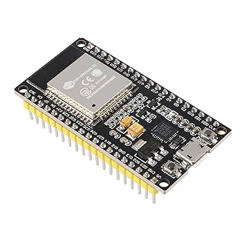

# WRO-FUTURE-ENGINEERS-2025 - TEAM TUREAH

---

## Vehicle Preview

---
An autonomous vehicle designed for the Future Engineers category of the WRO 2025 that uses computer vision and IMU sensors to navigate complex environments and avoid obstacles intelligently.

## Content Structure

📁 **t-photos** → team photos  
📁 **v-photos** → vehicle photos  
📁 **video** → video.md with demonstration link  
📁 **schemes** → schematic diagrams  
📁 **src** → control software  
📁 **models** → 3D printing / laser cutting / CNC files  
📁 **other** → documentation and additional resources  
## Project Overview
This repository contains all the engineering materials, code, schematics, and models related to our self-driven vehicle, designed and built to participate in the WRO Future Engineers 2025 competition. The project aims to develop an autonomous vehicle capable of navigating a predefined course while demonstrating precision, stability, and effective control of electromechanical components.

Our vehicle is a compact, versatile model incorporating both mechanical and electronic systems. It is designed to efficiently demonstrate autonomous navigation using sensors, motor control, and a central microcontroller. The design and implementation of this project involved detailed planning, testing, and iterative improvements to meet the strict requirements of the competition.
## 🔍 Project Description
**🎯 Goals**  
1. Build a functional self-driven vehicle that can navigate a course autonomously.  
2. Integrate electronic and mechanical components seamlessly.  
3. Develop modular and maintainable code to control all vehicle components.  
4. Document all aspects of the vehicle's design, construction, and programming.  
5. Provide clear and detailed engineering materials to facilitate understanding and replication.  

{width=20 height=20} **ESP32-WROOM-32 Overview**

