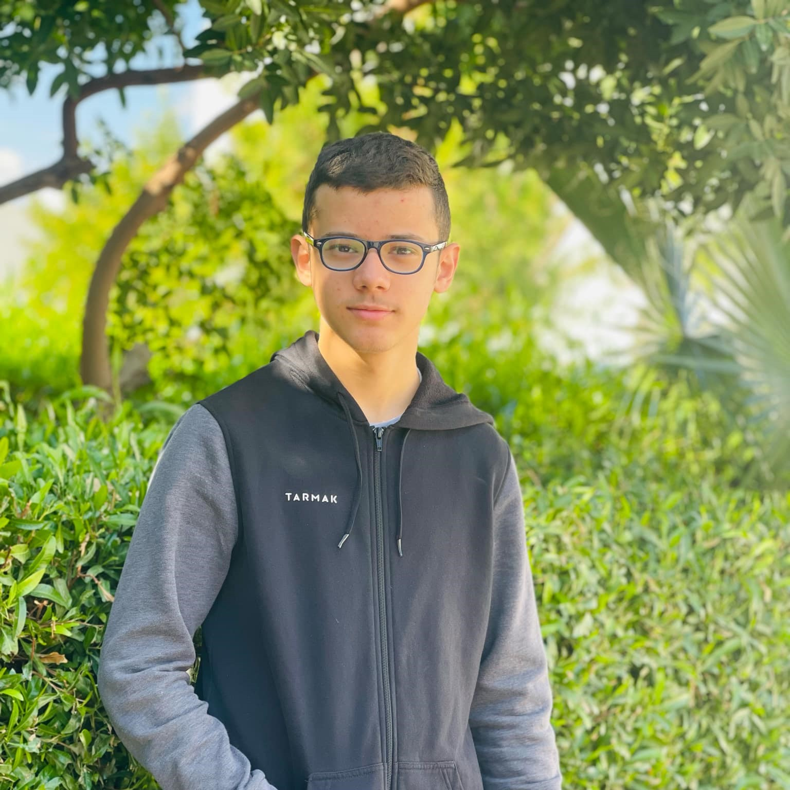
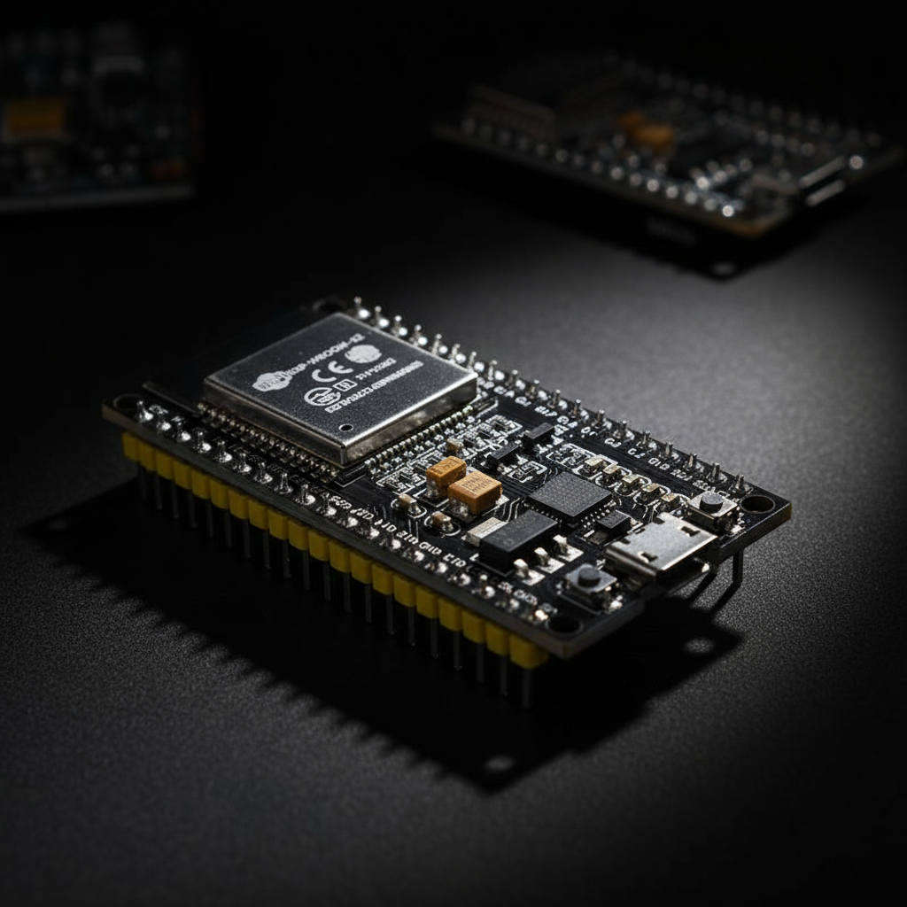
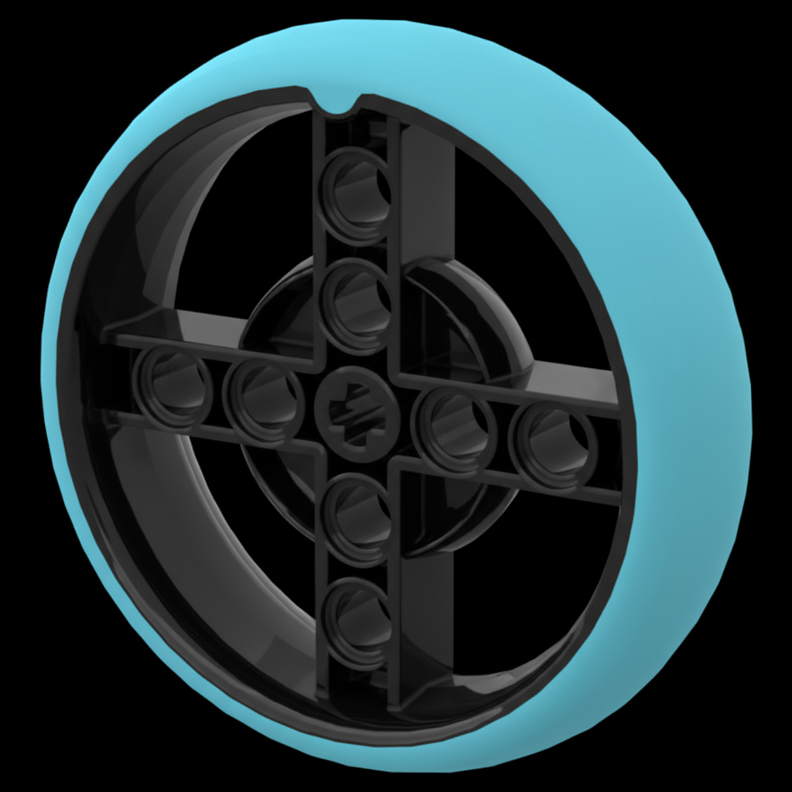
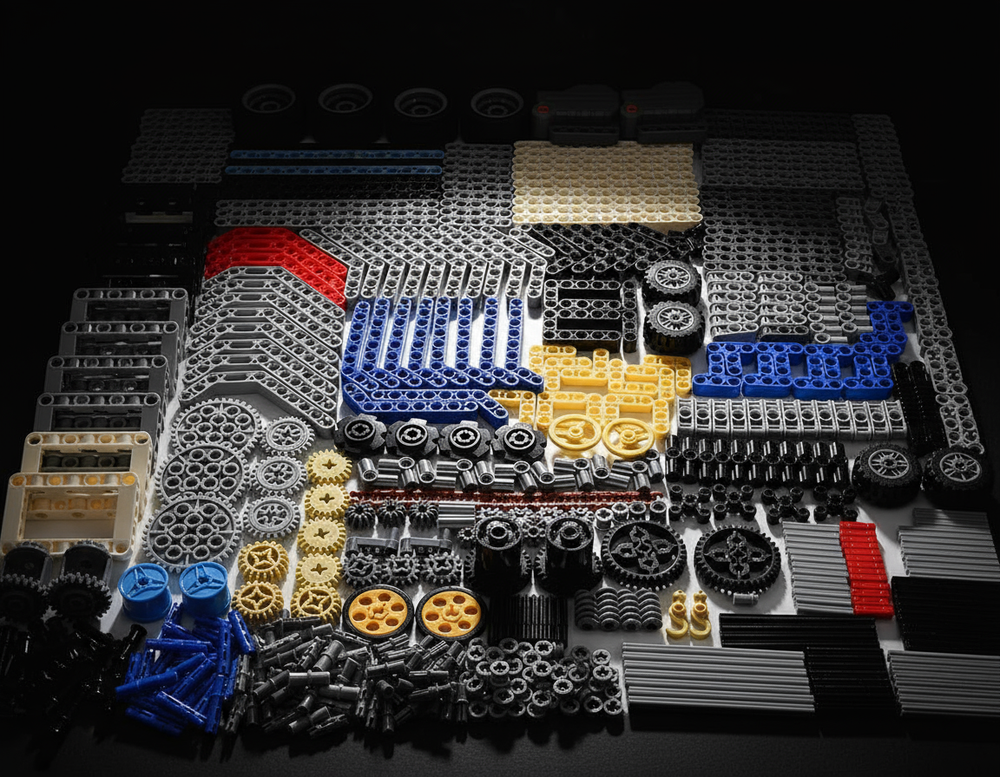
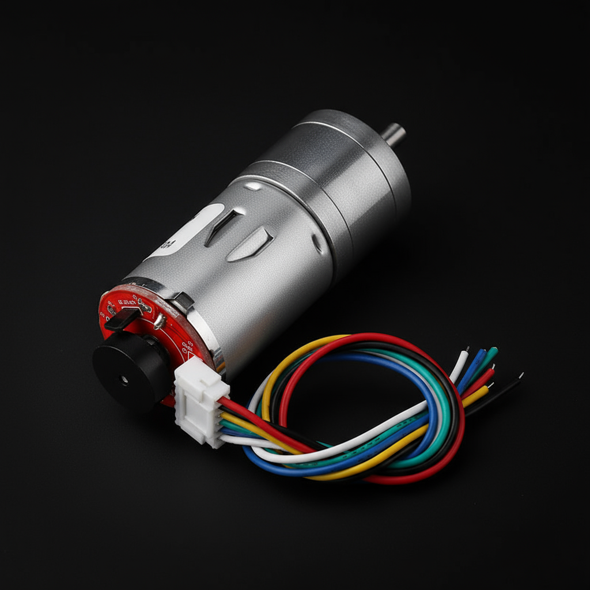
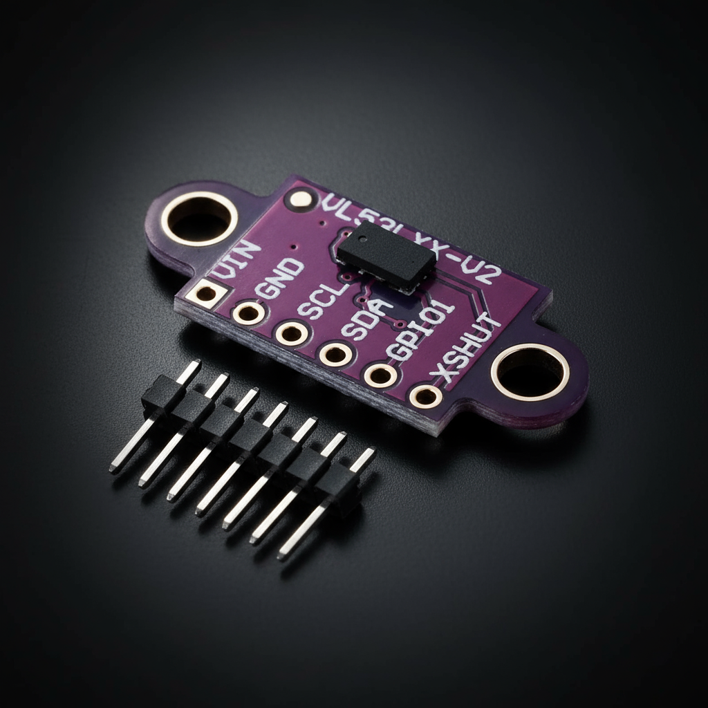
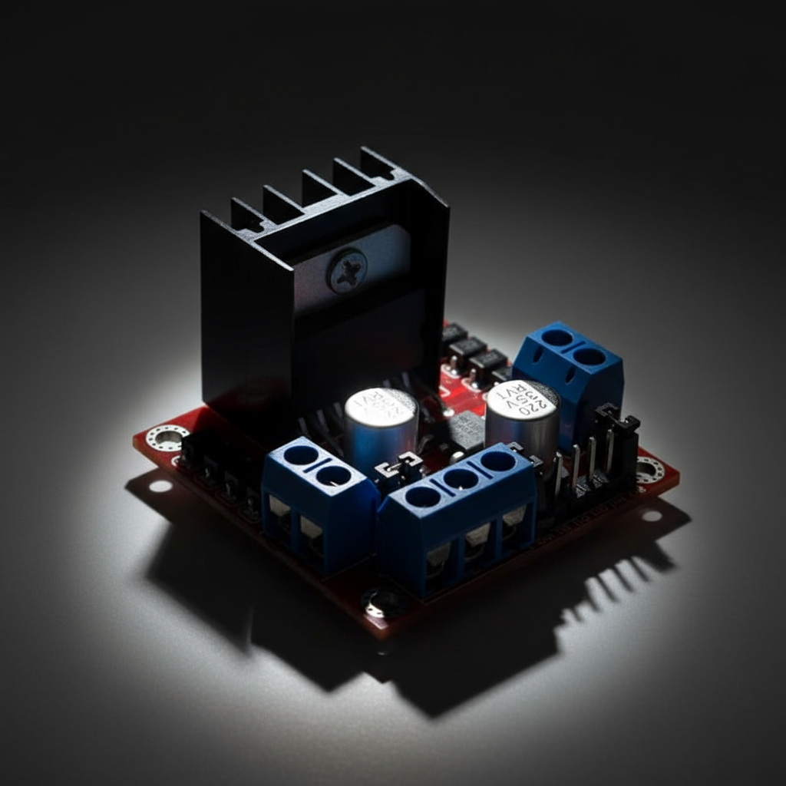
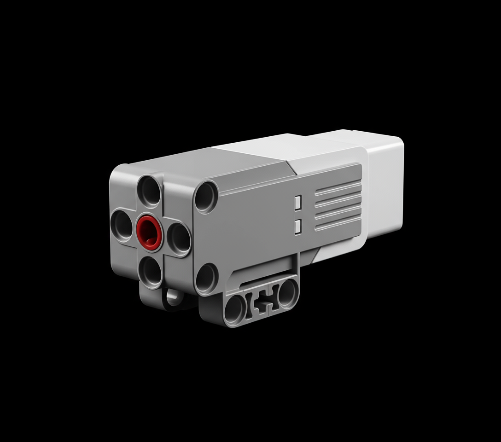
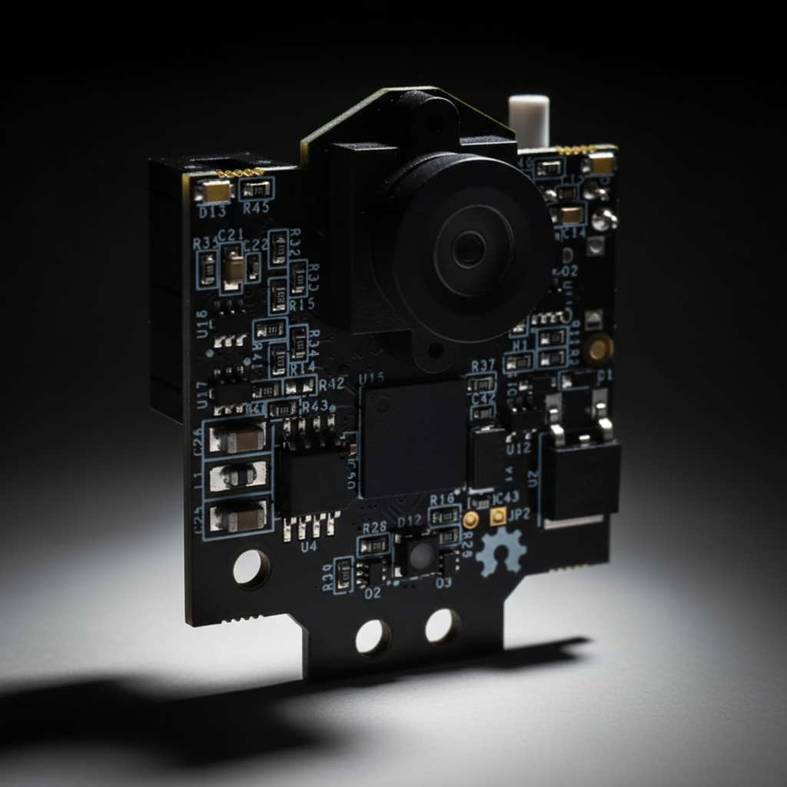

# WRO-FUTURE-ENGINEERS-2025 - TEAM TUREAH

---

## Vehicle Preview

---
An autonomous vehicle designed for the Future Engineers category of the WRO 2025 that uses computer vision and IMU sensors to navigate complex environments and avoid obstacles intelligently.

## Content Structure

📁 **t-photos** → team photos  
📁 **v-photos** → vehicle photos  
📁 **video** → video.md with demonstration link  
📁 **schemes** → schematic diagrams  
📁 **src** → control software  
📁 **models** → 3D printing / laser cutting / CNC files  
📁 **other** → documentation and additional resources  
## Project Overview
This repository contains all the engineering materials, code, schematics, and models related to our self-driven vehicle, designed and built to participate in the WRO Future Engineers 2025 competition. The project aims to develop an autonomous vehicle capable of navigating a predefined course while demonstrating precision, stability, and effective control of electromechanical components.

Our vehicle is a compact, versatile model incorporating both mechanical and electronic systems. It is designed to efficiently demonstrate autonomous navigation using sensors, motor control, and a central microcontroller. The design and implementation of this project involved detailed planning, testing, and iterative improvements to meet the strict requirements of the competition.
## -------------------------------------------------------------------------------------
## Who We Are

<!-- 

 -->

  <figure>
    
    <figcaption>كريم - مبرمج رئيسي</figcaption>
  </figure>
  <figure>
    
    <figcaption>عتيلي - مهندس أجهزة</figcaption>
  </figure>
  <figure>
    
    <figcaption>أسامة - كبير الاستراتيجيين</figcaption>
  </figure>

We are a team of three passionate Palestinian students from Tulkarm Industrial Secondary School, united by our love for programming, artificial intelligence, and problem-solving. Osama Jadbah, an 11th-grade student, focuses on lifelong learning, self-development, and has earned multiple excellence certificates for his achievements. Mohammad Attili, 16, is a competitive programmer who has excelled in national and international contests, showcasing his innovation and tech skills. Kareem Amr, also 16, is a skilled programmer and problem solver, experienced in algorithms and competitive programming, and an accomplished chess player who earned 3rd place in the Palestinian Chess Championship. Together, we strive to develop our skills, tackle challenging projects, and explore new technological horizons.

## -------------------------------------------------------------------------------------
## 🔍 Project Description
**🎯 Goals**  
1. Build a functional self-driven vehicle that can navigate a course autonomously.  
2. Integrate electronic and mechanical components seamlessly.  
3. Develop modular and maintainable code to control all vehicle components.  
4. Document all aspects of the vehicle's design, construction, and programming.  
5. Provide clear and detailed engineering materials to facilitate understanding and replication.  

 ## ⚙️ Physical Equipment  
**1. 🧠 ESP32-WROOM-32 Overview**
1. ESP32-WROOM-32 is a microcontroller by Espressif with Wi-Fi and Bluetooth, commonly used in smart devices and robotics.
2. It features a dual-core Xtensa 32-bit LX6 processor up to 240 MHz, with 520 KB SRAM and 4 MB Flash.
3. Offers around 34 programmable GPIO pins and interfaces like SPI, I2C,  UART, PWM, and I2S, with ADC/DAC support.  
4. Supports dual connectivity, multiple protocols, and has a large  community with ready-to-use libraries.  
5. Common applications include robotics, smart home systems, remote   measurement/control devices, and IoT data collection.  
                    
**2. 🤖 L298N (Motor Driver Module) Overview**
1. The L298N is a dual H-bridge motor driver used to control the speed and direction of DC and stepper motors.
2. Supports motor voltages from 5V to 35V and currents up to 2A per channel.
3. Motor direction is controlled via IN1–IN4 pins and speed via PWM (ENA/ENB pins).
4. Features include independent dual motor control, built-in heat sink, and easy interfacing with Arduino, ESP32, and Raspberry Pi.
5. Commonly used in robotics, motorized DIY projects, and stepper motor control for small CNC machines or 3D printers.

**3. 📏 VL53LXX-V2 (Time-of-Flight Distance Sensor) Overview**     
1. The VL53L0X/VL53L1X is a Time-of-Flight (ToF) distance sensor that measures distance using laser light.
2. Measurement range: VL53L0X ~30 mm–2 m, VL53L1X ~30 mm–4 m with typical accuracy ±3%.
3. Uses I²C interface, supports multiple sensors on the same bus, with power supply 2.6–3.5V.
4. Features include fast and accurate distance measurement, non-contact sensing, low power consumption, and works in various lighting conditions.
5. Common applications: robotics obstacle detection, drones, gesture/proximity sensing, level measurement, and automated safety systems.
     
**4.🎥 Pixy 2.1 (CMUcam5) Overview**
1. The Pixy 2.1 is a smart vision sensor that detects and tracks objects by color or shape.
2. Resolution: 320×200 pixels, frame rate up to 60 fps, with interfaces SPI, I²C, UART, and USB.
3. Built-in processor allows real-time object recognition and can track multiple objects simultaneously.
4. Sends object coordinates directly to microcontrollers like Arduino or ESP32, reducing main board load.
5. Common applications include line-following robots, object detection/sorting, interactive projects, and educational AI experiments.

**5. 🚗 LEGO Wheel Ø56 with Medium Azure Tire Overview**
1. LEGO Technic wheel with a 56 mm diameter and medium azure rubber tire.
2. Part numbers: 39367 (wheel) and 1282073 (tire).
3. Designed for medium-sized LEGO vehicles and robots.
4. Durable and easy to fit with LEGO axles, providing reliable traction.
5. Common uses: LEGO Mindstorms robots, Spike Prime projects, and DIY educational builds.

**6. ⚡ GM25 370 Motor Overview**
1. The GM25 370 is a compact DC geared motor with ~260 RPM at 6V DC.
2. Provides high torque output, ideal for driving wheels and robotic arms.
3. Shaft diameter ~4 mm with standard mounting holes for small chassis.
4. Can include a hall encoder for precise speed/position feedback.
5. Commonly used in small robots, cars, and DIY mechanical systems.      
                 
**7. ⚙️ EV3 Medium Motor Overview**

1. A LEGO Mindstorms motor designed for precise and controlled movement.
2. Operates at ~255 RPM with medium torque, ideal for steering mechanisms.
3. Features a built-in rotation sensor for accurate position feedback.
4. Supports precise angle control (servo-like behavior) and smooth acceleration.
5. Commonly used in LEGO Technic robots for steering and articulated parts.
      
**8. 🧩 EV3 LEGO Technic Set Pieces Overview**
1. Modular LEGO Technic parts used to build robots, vehicles, and mechanical systems.
2. Include beams, liftarms, axles, connectors, gears, pulleys, pins, and bushings.
3. Provide the structural framework and enable integration of motors, sensors, and controllers.
4. Designed for reusability and compatibility with LEGO EV3 robotics kits.
5. Commonly used for creating chassis, motion systems, and custom robotic designs.      
 
 

  
  
  
  
  
  
  
  

## -------------------------------------------------------------------------------------
## 🎮 The Code 

## Robot Videos  

  
  

