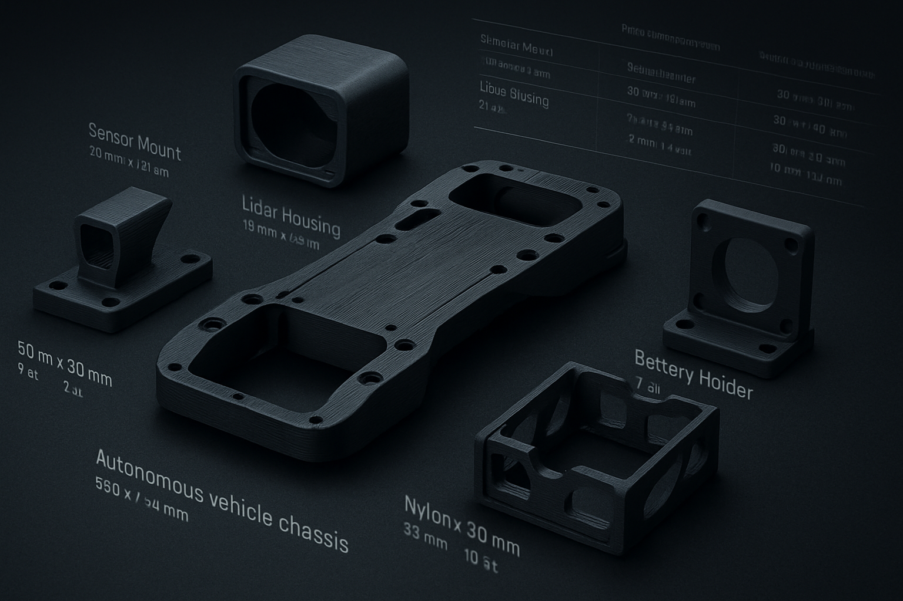

## This folder contains a number of 3D models that we printed to fit the pre-prepared chassis. It also includes the components used and a comparison table between them and other components available in the market.

<table>
  <tr>
    <td>
      
    </td>
    <td>
      

        <a href="https://github.com/MohdAttili/TSISFE2025/blob/main/models/Pixy2_Cover.stl">Pixy2_Cover</a> 
        <a href="https://github.com/MohdAttili/TSISFE2025/blob/main/models/enhanced_holder.stl">enhanced_holder</a> 
        <a href="https://github.com/MohdAttili/TSISFE2025/blob/main/models/motor%20adapter%20for%20lego.stl">motor adapter for lego</a> 
        <a href="https://github.com/MohdAttili/TSISFE2025/blob/main/models/Gyroscope%20Holder.stl">Gyroscope Holder</a> 
        <a href="https://github.com/MohdAttili/TSISFE2025/blob/main/models/Motor%20Driver%20Case.stl">Motor Driver Case</a> 
        <a href="https://github.com/MohdAttili/TSISFE2025/blob/main/models/Motor%20Driver%20Case%20Cap.stl">Motor Driver Case Cap</a>     
        <a href="https://github.com/MohdAttili/TSISFE2025/blob/main/models/Servo%20to%20lego%20adapter.stl">motor adapter for lego</a>    
      

    </td>
  </tr>
</table>
