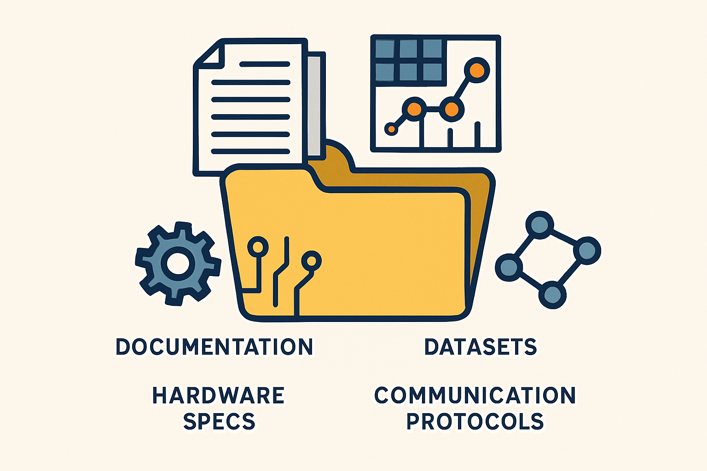

## This folder contains other documentation, datasets, hardware specs, or communication protocols.
<table>
  <tr>
    <td>
      
    </td>
    <td>
      

        <a href="https://github.com/MohdAttili/TSISFE2025/blob/main/other/Comparison%20with%20Other%20Components.pdf">Comparisons with Other Components in the Market</a> 
        <a href="https://github.com/MohdAttili/TSISFE2025/blob/main/other/Selected%20Components.pdf">More Details about the Componentsl</a> 
        <!-- <a href="https://github.com/MohdAttili/TSISFE2025/blob/main/models/motor%20adapter%20for%20lego.stl">motor adapter for lego</a> 
        <a href="https://github.com/MohdAttili/TSISFE2025/blob/main/models/Gyroscope%20Holder.stl">Gyroscope Holder</a> 
        <a href="https://github.com/MohdAttili/TSISFE2025/blob/main/models/Motor%20Driver%20Case.stl">Motor Driver Case</a> 
        <a href="https://github.com/MohdAttili/TSISFE2025/blob/main/models/Motor%20Driver%20Case%20Cap.stl">Motor Driver Case Cap</a> -->
      

    </td>
  </tr>
</table>
