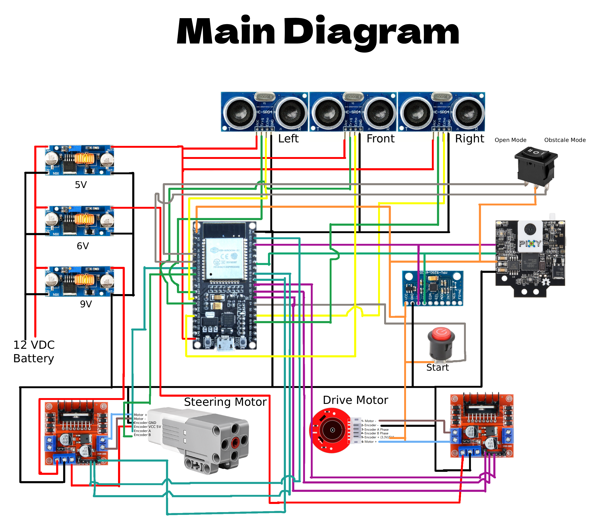

## This folder contains schematic diagrams of the vehicle's electromechanical components, including wiring layouts, circuit connections, and mechanical assembly details. These diagrams are provided to document the design and help with troubleshooting or future modifications.

  

